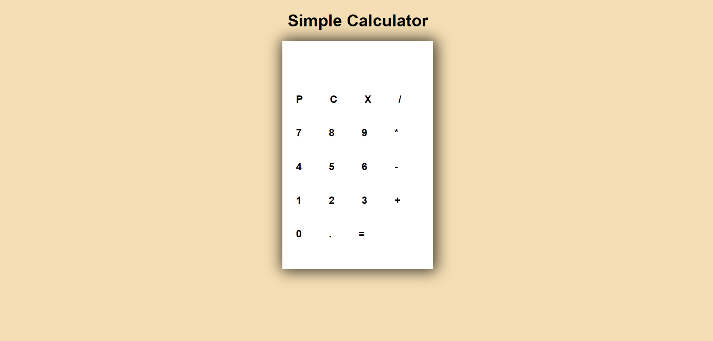

# Simple Calculator

## Introduction
It is a simple calculator that performs airthmetic operations only on two numbers at a time.

## Features
* Performs airthmetic operations on two numbers at a time.
* Gives accurate result.
* Has all the funcitonalities similar to an actual calculator.

## Implementaion

## Tech Stack
* HTML
* CSS
* JAVASCRIPT

## Website
Click [here](https://chinmay908.github.io/simpleCalculator) to view.
